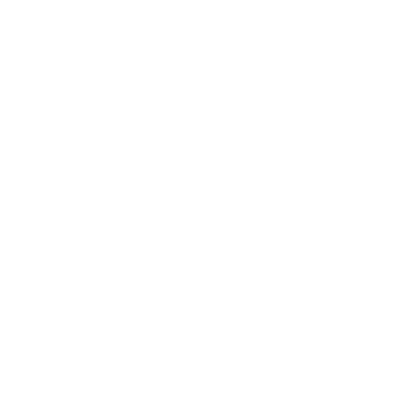
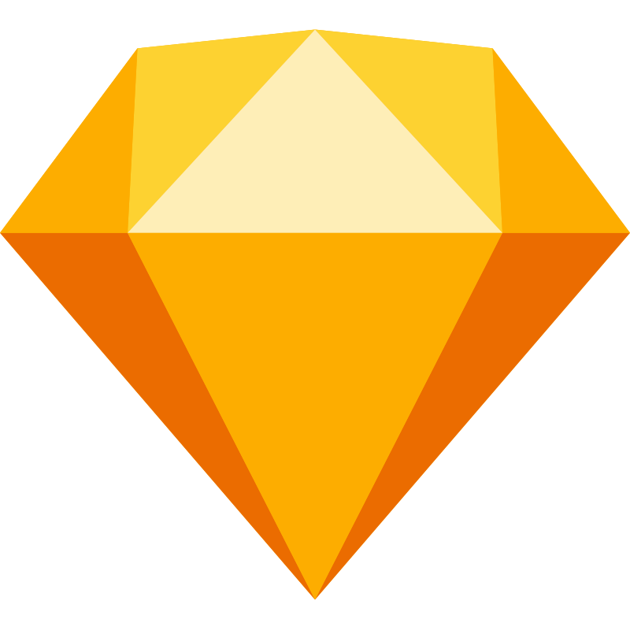

<h1 align="center">Hi there, I'm Sitnikov Dmitry </h1>
<h3 align="center">Frontend Developer</h3>

- 🌱 I am currently studying web technologies

- 📝 I regularly read the software documentation and other useful literature

- 🌍 I speak Russian (native), English (B1)

### Connect with me:

### Languages:

 

### Tools:

 

